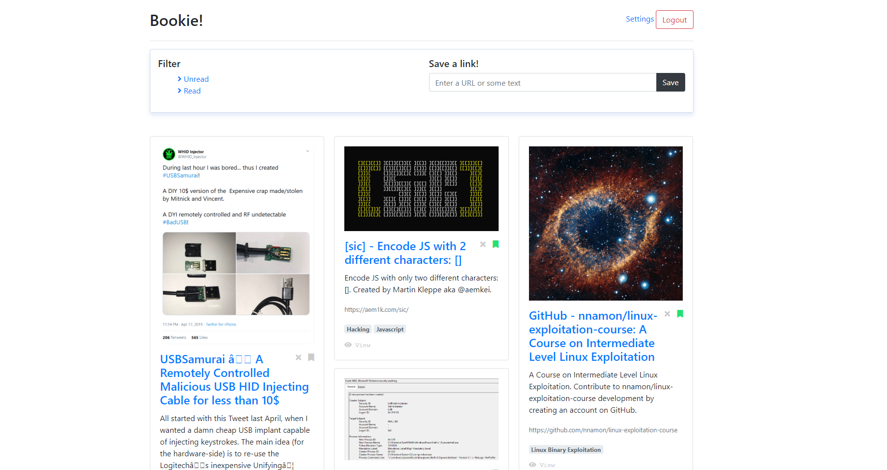
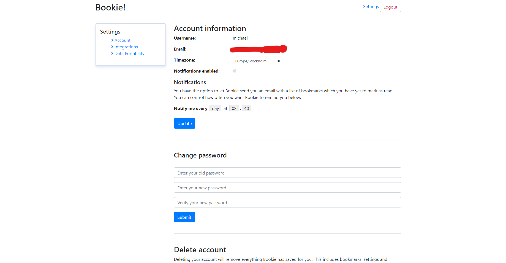
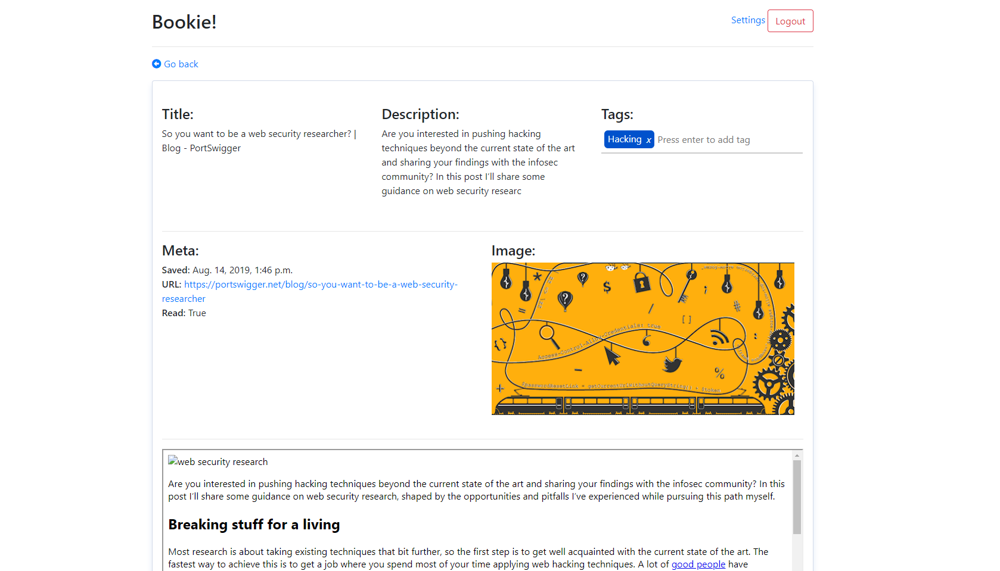

# Bookie!

**Bookie** is a simple Django app that stores links to information you intend to consume later. For example, if you found yourself bookmarking information from social media and websites, but your bookmarks are stored all over the place *and* you also forget to check what you have saved, then Bookie is for you!

*Right now, you can only save links through Telegram.*

## Motivation

I save a lot of links, tweets and articles that I intend to read later, but I always forget to actually check my what I have saved. On twitter I use the *like* or *bookmark* functionality to save interesting tweets for later. Sometimes I save them to my *Saved messages* on Telegram or use the Google Inbox bookmark functionality. Needless to say, I need a single source which stores all my links and notifies me after some period of time to remind me what I recently saved. And so Bookie was born.

## Vision

My vision for Bookie includes:
- Mobile app
- Browser extension to save links directly from the browser
- More integrated services
- To be the number one source for all your saved links

## Local Development

Want to hack on bookie locally? Just clone the repo and run `docker-compose -f dev.yml up -d` and you're good to go :) For more information, check out the [documentation](docs/README.md).

## Contributing
Any feedback or ideas are welcome! Want to improve something? Create a pull request!

1. Fork it!
2. Create your feature branch: `git checkout -b my-new-feature`
3. Configure pre commit checks: `pre-commit install`
4. Commit your changes: `git commit -am 'Add some feature'`
5. Push to the branch: `git push origin my-new-feature`
6. Submit a pull request :D
